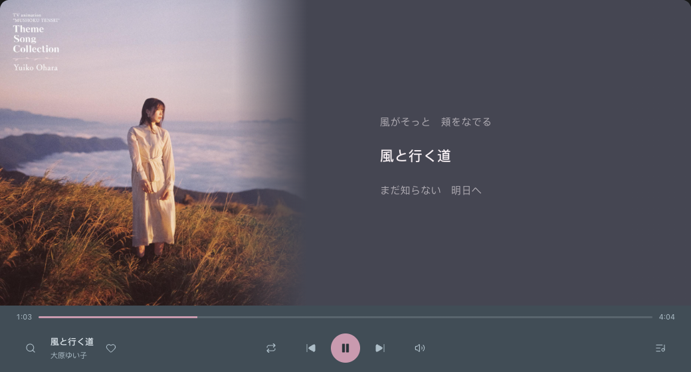
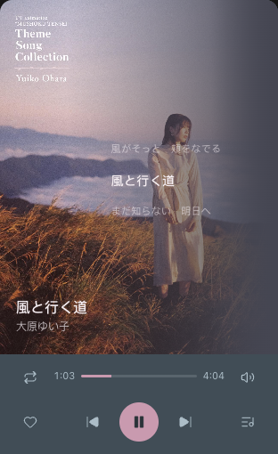

# 「静听」控制栏 · 定稿与实现交接

2026-10-10。用户已选定「静听 · 连续布局」，本文件供实现 agent 直接接线。

> **任务：把选定草图的控制栏布局、图标、跨尺寸一致性和动效落进当前生产 UI。音量组件保留仓库最新实现，不能用草图中的音量面板替换。**
>
> 这次交付是设计交接；生产文件尚未由本次设计工作修改。仓库已有其他进行中的修改，开工前先读当前文件和 `git diff`，不得重置或覆盖它们。

## 1. 决策顺序与参考文件

优先级：**用户最新指令 → 本文的音量保留条款 → 本文定稿 → 最新「静听 · 连续布局」草图 → 旧控制栏简报**。

- [可打开的完整预览](refs/quiet-controls/approved-preview.html)：观察交互与缩放动画。
- [原始草图源码](refs/quiet-controls/approved-fragment.html)：查具体数值、结构与动画。
- [窗口截图](refs/quiet-controls/window.png)、[长卡截图](refs/quiet-controls/long.png)、[窄卡截图](refs/quiet-controls/narrow.png)。
- [图标 SVG 文件](refs/quiet-controls/icons/)：已从实际渲染的草图中导出，无需凭截图描摹。
- [最新音量交接](REFINE-DONE-VOLUME.md)：必须保留，尤其末尾 §7。
- [现状说明](CONTROL-BAR-BRIEF.md)：用于定位旧代码；其中“窄卡七等分”“宽窗左翼等距”等旧建议已被本定稿替代。

原型只用演示数据，不连接真实音频或 Hana。完整预览的宿主辅助组件使用 CDN；生产只取本地 SVG 与必要的布局/动效，不引入这些 CDN 脚本。

原始草图保留了早期比较方案的未使用样式和模板。**真正定稿的是 `.quiet`、`.unified-control`、注释 `One control surface at every size` 之后的覆盖规则，以及 `arrange()` 的连续布局思路。** 不要把整份文件直接覆盖进生产。

## 2. 必须保留的音量版本

本次读取的生产构建号为 **1003131610**。如果实施时又有更新，以用户 agent 的最新版本为准。

现有音量已经定为：

- 三种布局统一使用一颗按钮；**悬停或键盘聚焦，向上展开竖向音量条**。
- **点击按钮切静音**，不是打开面板。移开后收回；保留 90ms 关闭宽限、拖动保护和 Esc 优先收起。
- 保留 `.vol-group` / `#muteBtn` / `.vol-pop` / `#volPop` / `#vol` 及其现有事件、状态、持久化。
- 保留 `.vol-group::before` 的透明悬停桥，不能让指针经过按钮和浮层之间的空隙时误关闭。
- 静音时滑杆显示零，但 `state.volume` 保持原值；取消静音恢复原音量。拖到非零自动解除静音。
- 当前面板 42 × 136px、轨道长 108px，旋转为竖条；样式、展开/收回动效沿用最新生产代码。
- 当前 `.vol-pop` 为 `z-index:40`，必须实际盖过队列、遮罩、搜索页。不能被新加的父级 stacking context 或 `overflow:hidden` 截住。

**允许改变的是整个 `.vol-group` 在控制栏中的位置，使它参与响应式排列；内部结构、交互和动效不变。** 外层可增加移动定位用的包裹层，但 `.vol-group` 本身必须继续保留可定位的实体盒，不能 `display:contents`。

草图里的“点击弹出横向滑杆、面板内另放静音键”、音量数值恢复方式、音量弹层尺寸均不采纳。本交接也没有提供音量图标替换文件，避免覆盖这轮最新成果。

## 3. 视觉目标

中央的“上一首 / 播放暂停 / 下一首”是一组稳定的核心操作。窗口、长卡、窄卡只改变周围空间与辅助控件位置，**不换另一组按钮、不改三键比例、不把它们摊进全行等分格**。

搜索位于宽窗最左端，从左侧展开搜索页；队列入口位于最右端，从右侧展开。歌名和红心紧邻成组。循环靠中央三键左侧，音量靠右侧；特别窄时二者上移一行。

沿用 Hana 宿主主题。原型中的深板岩和粉色只是预览皮肤，生产继续消费 `--hk-*` / `--hl-accent`。不创建新的明暗主题、不覆盖宿主同名变量、不添加整体玻璃或外阴影。

### 窗口



### 长卡


### 窄卡



截图中的封面、歌词、曲目、队列长度都是演示内容。舞台标题的位置、封面处理、曲库业务不属于本次强制重做范围；保留当前生产能力。重点复现控制栏及尺寸切换时的空间连续性。

## 4. 核心比例：三种尺寸完全一致

下列尺寸为 CSS px，不随 DPR 改变。

| 项目 | 定稿值 |
|---|---|
| 中央三键整组 | 宽 148、高 44 |
| 三颗按钮的命中盒 | 各 44 × 44 |
| 播放圆直径 | 44；原 48 略收小，窄卡也不另改为 42 |
| 相邻命中盒间距 | 8 |
| 上一首—播放、播放—下一首的中心距 | 均为 52 |
| 上/下一首图标 | 18 × 18，实心三角，`stroke-width:1.3` |
| 播放/暂停图标 | 19 × 19，`stroke-width:1.5`，播放三角与暂停条填充 |
| 普通功能图标 | 19 × 19，线描，`stroke-width:1.65` |
| 核心组距控制栏底边 | 14 |
| 常规控制栏高 | 100 |
| 特别窄控制栏高 | 112 |

普通图标不需要跟随命中盒变大。44px 是按钮盒，不能把内部 18/19px 图形也画到 44px。

保持核心组几何中心与播放器宽度中心重合。长歌名、搜索展开、队列数量、红心状态均不能推动它。

可以复用现有 `.cell-center`，也可以使用独立定位包裹层。关键结构如下，选择器仅为示意：

```css
.transport-anchor {
  position: absolute;
  left: 50%;
  bottom: 14px;
  transform: translateX(-50%);
}
.transport {
  display: flex;
  align-items: center;
  gap: 8px;
  width: 148px;
  height: 44px;
}
.transport > button { flex: 0 0 44px; width: 44px; height: 44px; }
.transport .play-btn { border-radius: 50%; }
```

保留 `#prevBtn` / `#playBtn` / `#nextBtn` 的同一份节点和现有事件。不要为不同尺寸各生成一份控件，也不要让 `.cell-center` 在窄卡退化成 `display:contents`。

## 5. 响应式布局

### 5.1 两套判断分开

整体承载沿用生产判断：

```js
layout = width >= 720 ? 'wide' : height >= 560 ? 'long' : 'compact';
```

控制栏另外判断是否特别窄：

```js
controlsNarrow = width < 400;
```

**400 是控制栏辅助按钮换行点。不要直接把现有全局 `data-bar="tight"` 的 420 阈值改掉**，它还影响舞台文字等旧规则。可以增加专用于控制栏的属性。

### 5.2 位置关系

令 `C = 播放器宽度 / 2`，`P = 宽窗 24、非宽窗 12`。下面描述按钮中心点，非左边缘。

| 元素 | 宽窗 | 非宽窗、宽 ≥ 400 | 宽 < 400 |
|---|---|---|---|
| 上一首 / 播放 / 下一首 | `C-52 / C / C+52` | 相同 | 相同 |
| 搜索 | 最左，`P+22` | 隐藏且不可聚焦 | 隐藏且不可聚焦 |
| 曲目信息 | 搜索右侧，歌名/歌手两行 | 控制栏隐藏 | 控制栏隐藏 |
| 红心 | 紧邻曲目信息 | 最左，`P+22` | 最左，`P+22` |
| 循环 | `C-112`，与主按钮同一行 | 相同 | 上移到进度条左侧，`P+22` |
| 音量组外层 | `C+112`，与主按钮同一行 | 相同 | 上移到进度条右侧，`W-P-22` |
| 队列 | 最右，`W-P-22` | 相同 | 相同 |

特别窄时，中央三键仍留在原来的下行，不跟着循环/音量一起上移。上行循环和音量按钮距底边 64px，下行按钮距底边 14px。

音量组按本表参与移动即可，内部全部遵守 §2。如果最新音量实现对外层有新约束，先保留该组件，用布局包裹层解决，不能还原成原型音量。

### 5.3 曲目信息与进度

- 歌名 13px、歌手 11px；歌名一行省略，完整文本可通过现有提示机制读取。红心属于这组，但不随长歌名越过循环按钮。
- 草图信息组左侧为 `P+52`，可用宽度上限约 `50% - P - 202px`，文字与红心间距 4px，文字最大 200px。不再把歌名强行居中占固定 160px。
- 原型对 849 × 599 且长歌名的状态有用户查看记录；这是需要验证的中间尺寸，不是新的固定窗口大小。
- 常规进度行：顶部 3px、行高 28px，两侧 inset 为 P，时间与滑杆间距 10px。
- 特别窄：顶部 10px，两侧 inset 为 `P+48px`，间距 7px，为循环/音量让位。
- 时间 11px，等宽数字；进度轨道 3px，使用主题色和中性轨道色。
- 保留原生 range 的拖动和键盘行为、真实时长与 seek 逻辑。

## 6. 图标：使用提供的形状，不重新凭感觉画

用户认可的图标来自 **Lucide**，不是本次手工原创。预览运行时为 `lucide@1.17.0`。已导出实际形状，原包许可全文放在 [LUCIDE-LICENSE.txt](refs/quiet-controls/icons/LUCIDE-LICENSE.txt)，含其声明的 Feather 衍生部分说明。

生产复用现有内联 `<symbol>` / `<use>` 机制。把对应 SVG 的子元素移入原 symbol，保留 `viewBox="0 0 24 24"` 和当前 symbol id，统一用 `currentColor`；**不新增在线图标请求、不引入整套运行时、不因此增加 manifest 网络权限**。把图标许可随实际使用的生产包保留。项目整体继续遵循原有 AGPL-3.0。

| 生产 symbol | 已提供文件 | 用法 |
|---|---|---|
| `i-search` | [search.svg](refs/quiet-controls/icons/search.svg) | 线描 |
| `i-heart` | [heart.svg](refs/quiet-controls/icons/heart.svg) | 未喜欢空心，喜欢后 `fill:currentColor` |
| `i-repeat` | [repeat.svg](refs/quiet-controls/icons/repeat.svg) | 列表循环 |
| `i-repeat-one` | [repeat-1.svg](refs/quiet-controls/icons/repeat-1.svg) | 单曲循环 |
| `i-shuffle` | [shuffle.svg](refs/quiet-controls/icons/shuffle.svg) | 随机 |
| `i-prev` | [skip-back.svg](refs/quiet-controls/icons/skip-back.svg) | 实心三角与端线 |
| `i-play` | [play.svg](refs/quiet-controls/icons/play.svg) | 实心，视觉上右移约 2px |
| `i-pause` | [pause.svg](refs/quiet-controls/icons/pause.svg) | 实心双条 |
| `i-next` | [skip-forward.svg](refs/quiet-controls/icons/skip-forward.svg) | 实心三角与端线 |
| `i-list` | [list-music.svg](refs/quiet-controls/icons/list-music.svg) | 音乐队列语义 |
| `i-close` | [x.svg](refs/quiet-controls/icons/x.svg) | 线描关闭 |

所有线描均使用圆线帽、圆连接。SVG 文件的根属性是中性导出值；最终显示尺寸、描边粗细与填充按 §4 应用。

实心规则必须跟随**图标职责**，不能只挂在宽窗 `.transport` 下而遗漏卡片。上一版草图的割裂确实有这个原因：卡片按钮被展平后失去宽窗的实心选择器。本版用同一组 DOM 消除差异。

更新共享 symbol 后，要检查队列、搜索列表、舞台上的红心等复用位置，继续保持同一颗歌的状态同步。不要改音量相关 symbol。

## 7. 动效定稿

主缓动沿用 `cubic-bezier(0.22, 0.61, 0.36, 1)`。感觉是短促响应、柔和停稳，无明显弹跳。操作状态立即提交，动画只呈现变化；不能等待动画结束才播放、收藏或响应第二次点击。

| 动作 | 目标动效 | 时长 |
|---|---|---|
| 普通图标悬停 | 淡出入轻微主题底色/字色 | 140ms |
| 按钮按下 | `scale(0.96)`，松开恢复 | 约 140ms |
| 播放圆悬停 | `scale(1.025)`，亮度约 1.04 | 180ms |
| 播放/暂停图标切换 | 同位置交叉淡入淡出，图形 `scale(.82)↔1`；按钮圆和位置不跳 | 透明度 160ms、缩放 240ms |
| 红心反馈 | 填充立即更新；比例 `1 → 1.16 → .98 → 1`，40%/70% 为中间点 | 360ms |
| 切歌后的曲目信息 | 从下方 5px 回位，透明度 `.25 → 1`；只作用于文字 | 260ms |
| 进度滑块悬停/聚焦/拖动 | 小圆点由弱到显、`.6 → 1` | 140ms |
| 搜索展开/收回 | 从左侧 `translateX(-100%) ↔ 0`，伴随透明度变化 | 位移 320ms、透明度 240ms |
| 宽窗队列抽屉 | 从右侧 `translateX(100%) ↔ 0` | 同上 |
| 辅助按钮跨断点换位 | 从当前可见位置连续移动到新位置，不闪现、不整体缩放 | 340ms |
| 控制栏 100/112 高度切换 | 平滑变高/变矮 | 340ms |
| 长卡常驻队列进入/退出 | 队列区域实际展开/收拢，并淡入淡出，舞台空间随之连续改变 | 空间 360ms、透明度 220ms |
| 音量相关一切动效 | **沿用最新生产版本** | 见音量交接 |

### 7.1 搜索与抽屉不能退化

- 搜索入口固定在左，队列入口固定在右；收回沿原路径反向，不能只做淡出后消失。
- 面板只覆盖舞台，不遮控制栏。搜索打开时，仍可呼出位于其上的队列。
- 保留现有搜索根层/详情层的分层返回、Esc、左下入口直接 toggle 语义。
- 保留既有“队列 > 遮罩 > 搜索 > 舞台”的关系，以及最新音量浮层高于这些层的要求。
- 真实长卡的队列是常驻区，不能照搬窗口抽屉把它永久藏掉。窄而矮时继续使用生产已有的播放页/队列页语义。
- 不能在退出动画刚开始时 `display:none`；退出完成后再卸载显示状态，并取消过期的收尾任务。打开时先恢复可测量布局，再开始动画。

### 7.2 两类“缩放”要区分

**真实宿主窗口拖动：** App 立即采用宿主实际分配的宽高，中央三键跟着几何中心实时移动。不要对根窗口宽高加 480ms 延迟，让内容落后于鼠标。

**跨断点的内部重排：** 用 340–360ms 过渡辅助按钮、队列区域等结构变化。普通像素级 resize 不必重复启动 FLIP。

草图里通过“窗口/长卡/窄卡”预设模拟窗口变形，外框用了 480ms；这是**演示控制**，不是让生产接管宿主窗口尺寸。草图自由宽度滑杆也取消了外框延迟。

原型的 1040 × 560、465 × 650、312 × 510 是对比样本；不要改 manifest 的 1040 × 780 默认窗口，也不要把样本大小钉死。原型长卡队列 174px 仅为两条假数据服务，生产保留可拖分隔比例、滚动、列表长度与用户保存的布局。

### 7.3 推荐的连续换位实现

1. 用现有 `ResizeObserver` / `applyLayout()` 获取当前 App 容器实际尺寸，判断整体布局与控制栏密度。
2. 仅在布局/密度状态变化时，记录红心、循环、音量**移动包裹层**的当前可见矩形。进行中的动画也要取当前视觉位置。
3. 取消这些包裹层上一轮动画，提交新布局，再读取目标矩形。父容器同时移动时，统一换算到各自布局前后的控制栏局部坐标。
4. 用位置差作为反向位移，通过 Web Animations 或同等方案将位移回到零，时长 340ms。
5. 动画中再收到反向调整，立刻从当前视觉位置接到新目标；不加等待锁，不排队重播，不让旧 `onfinish` 删除新状态。
6. 核心三键用百分比中心定位自然跟随宽度，**无需给它整体做 scale 或 FLIP**。其 44px 大小、52px 中心距整个过程中不变。

移动动画和按压动画使用不同节点：外包裹层负责位移，内 button 负责按压缩放。也不要让 FLIP 的 `transform:translate(...)` 覆盖核心定位所需的 `translateX(-50%)`。

新增 transform 会创建 stacking context。音量浮层即使仍写 40，也可能被新父层关在队列下面；必须检查实际遮挡和命中，而不只比较两个 z-index 数字。

### 7.4 减弱动态与状态连续性

- 首次加载直接落在正确尺寸，不从窗口态播放一次收缩动画。
- `prefers-reduced-motion: reduce` 时取消位移、缩放、弹跳及 WAAPI 布局动画；可以保留短淡入淡出。音量沿用已有 reduced-motion 分支。
- 真正隐藏的搜索按钮、收拢区域不可继续被 Tab 聚焦；使用现有可访问状态、`disabled` / `inert` / `hidden` 等合适机制。
- resize 不重新创建 audio、播放控件或事件处理，不发起播放/暂停，不重置进度、音量、队列滚动或拖动状态。
- 不复制原型的 `window.openai`、`Tweak`、演示数据或独立存储逻辑到 Hana。

## 8. 实施入口与顺序

开工先读仓库 `AGENTS.md` 和 `~/.hanako/skills/hana-app-creator/SKILL.md`，按宿主最新契约实现。

1. 核对当前 `ui/index.html` / `ui/standalone.html`、`ui/style.css`、`ui/app.js` 的实际差异与音量版本；旧文档关于“只差调试块”的描述可能已落后于当前 `data-shell` 结构，以当前承载契约为准。
2. 保留同一套播放器业务与节点 id，集中修改控制栏 DOM/CSS。废弃核心组在窄卡被七等分展平的规则。
3. 加入上述本地图标路径与作用域正确的样式；检查旧 `.play-btn .icon`、`.icon-sm`、tight 覆盖规则，避免更高权重把新比例冲掉。
4. 在现有布局函数附近接连续重排；搜索和队列复用现有生命周期，不再叠一套互相冲突的开关系统。
5. 将**当前完整音量组**放到新布局锚点，逐条确认 §2 未回归。
6. 同步两份 HTML 的对应结构、图标及构建标记，保留各自合法的 shell 差异；不新增框架或打包步骤。
7. 更新有意义的布局断言，运行 `node tools/verify-ui.mjs`；发现真实问题则修复，不能通过删掉居中、音量或宿主约束断言“通过”。
8. 完成后按仓库要求执行 `node tools/bump-build.mjs`。只改设计文档时无需 bump；实际改 UI 时必须。
9. 部署遵循当前会话授权和仓库流程：整包同步 `ui/`（HTML/CSS/JS/_build/必要资产），再 `extension_manager reload app:hanako-audio-player`。本任务不应扩展 manifest 权限；仅同步文件不 reload 不算部署完成。

不要改音源、搜索收藏去向、最近播放、随机上一首历史、歌词兜底、媒体会话、同源代理、音频反应链及 app-data。不要引入 `createMediaElementSource`。这些业务不属于控制栏视觉改造。

## 9. 验收要求

### 布局与比例

- 1040 × 780、849 × 599（长歌名）、720 × 780；465 × 930、585 × 1172；531 × 451、312 × 451，以及 312 × 930。
- 719/720/721px、399/400/401px 附近反复拖动；560px 高度边界也要检查。
- 浅/深主题、超长歌名、空队列、播放/暂停、队列展开、搜索展开。
- 三键盒始终 44 × 44、组宽 148、中心距 52/52；播放中心与播放器中心误差小于 1px。
- 三种形态里的上/下一首均为相同实心图标，不再出现宽窗实心、卡片空心。
- 无水平溢出、按钮互盖、进度行被挤成零宽、音量面板被裁、宿主安全区被新增控件占用。

### 动效与交互

- 连续缩放中，三键节点 identity 保持不变；其图标比例、间距不漂移。
- 队列常驻区展开/收拢时，舞台与底栏之间没有突然出现的大块空白；长列表还能滚到底。
- 搜索左进左出、队列右进右出；快速开关和途中反向不闪白、不失去响应。
- 动画中可继续播放、切歌、收藏、拖进度；缩放前后的真实播放状态和 `currentTime` 连续。
- 音量悬停可进入竖条、点击仍静音、静音显示零、恢复原值、拖动不中断；队列打开后音量浮层仍可见可拖。
- 音量最先响应 Esc 的优先级与现有分层返回一致。
- 开启 reduced-motion 后，无位移缩放；首次加载不播放布局变形动画。

### 验证边界

本次设计预览已经在独立 Chromium 中验证：1040/720/465/312 宽度，三键均 44 × 44、52/52 中心距，播放中心误差小于 0.01px；窗口到长卡的过渡中同一播放节点持续存在；无静态按钮重叠或运行时错误；reduced-motion 正常跳到目标布局。

这些结果**仅证明草图的视觉与几何行为**。草图没有真实音频，也不是 Hana 实机验收。实现 agent 必须重新跑当前生产检查，并在真实窗口/卡片内复核缩放、抽屉、音量、持续播放和截图观感。最新音量文档记录的 101/101 也不是本次移植已经通过的证明。

## 10. 完成时请交付

- 实际改动文件与布局/动效说明。
- 新版窗口、长卡、窄卡截图，以及至少一次连续缩放和快速反向开关的验证结果。
- 最新音量功能保留情况与相关断言结果。
- 构建号、是否整包同步、是否 reload，以及尚未进行的实机检查。

设计原则参考：[Apple HIG · Motion](https://developer.apple.com/design/human-interface-guidelines/motion)。这里采用的是方向一致、简短反馈和可中断的原则；本文的具体毫秒数和像素值来自已选定草图，并非 Apple 的强制数值。
